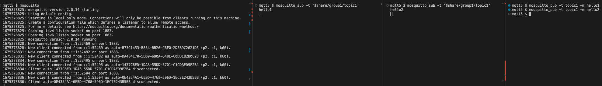
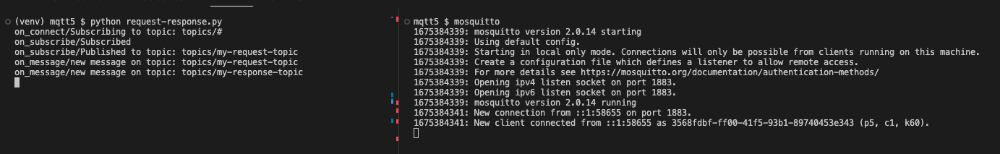

# MQTT v5 Demos

## Prerequisites

```sh
# Install mosquitto, mosquitto_sub, mosquitto_pub
brew install mosquitto
# Clone this repo
git clone git@github.com:ejdoh1/mqtt5-demos.git
```

## New MQTTv5 Feature: Shared Subscriptions

- Open 4 terminals
- Terminal 1
  - Run a mosquitto broker instance using Docker Desktop with `mosquitto`
- Terminal 2
  - First subscriber subscribes to the shared topic 'topic1' with `mosquitto_sub -t '$share/group1/topic1'`
- Terminal 3
  - Second subscriber subscribes to the shared topic 'topic1' with `mosquitto_sub -t '$share/group1/topic1'`
- Terminal 4
  - Lastly, publish messages to the shared topic with `mosquitto_pub -t topic1 -m hello1` then `mosquitto_pub -t topic1 -m hello2`
- Expected result is only one subscriber gets the first published message 'hello1', and only the other subscriber gets the second published message 'hello2'.
- More info, see [Oasis MQTT 5 Docs](https://docs.oasis-open.org/mqtt/mqtt/v5.0/os/mqtt-v5.0-os.html#_Toc3901250)

  

## New MQTTv5 Feature: Request-Response Topics

When publishing a message, the client specifies the response topic.

- Open two terminals
- Terminal 1
  - Run the mosquitto broker with `mosquitto`
- Terminal 2 run `python request-response.py`

```sh
virtualenv venv
source venv/bin/activate
pip install -r requirements.txt
python request-response.py
```

- Expected result is the MQTT client receives a message on the response topic it specifies when publishing a message to the request topic.



## References

- [AWS - Introducing new MQTTv5 features for AWS IoT Core to help build flexible architecture patterns](https://aws.amazon.com/blogs/iot/introducing-new-mqttv5-features-for-aws-iot-core-to-help-build-flexible-architecture-patterns/)
- https://github.com/aws-samples/aws-iot-mqttv5-examples
